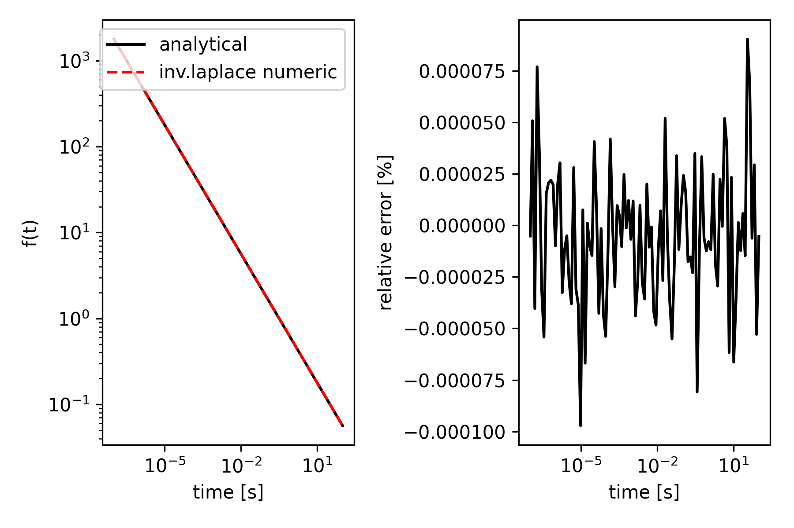

# The structure of anemone

Anemone consists of four modules.

2. **experiment** - objects representing experiment configuration parameters like transmit loop geometry, transmitter waveform, receiver filters, etc.
1. **forwards** - where everything comes together.
3. **transforms** - operators for the numerical computation of Hankel transforms, Fourier transforms and Inverse Laplace transforms.
4. **physics** - base routines like reflection coefficients, wave numbers, etc.


We will describe each of these modules here.

## Experiment

A module containing various python objects representing experimental setup parameters.

The `Loop` object contains the setup of the transmitter loop.
For example, a 3m x 3m transmit loop can be instantiated with the call:
```python
tx = Loop.square(3)
```

Similarly, the `Receiver` object sits in this module.

## Forwards

The forward module contains all the forward operators.

```python

```


## Transforms

This module contains objects that will perform transforms on functions. 

1. Hankel  transform
2. Fourier transform
3. inverse Fourier transform
4. inverse Laplace transform
5. Cubic spline

If a tensor of more than one dimension results from the function to be transformed, the transform is performed along the last axis in the tensor.

A test of the inverse Laplace transform gives a barebones example:
```python
    from anemone.transforms import invLaplace

    def f(t):
        return 1./torch.sqrt(torch.pi*t)

    def laplace_of_f(s):
        return 1./torch.sqrt(s)
```
Here is a function with its associated Laplace transform.
We can obtain a numerically evaluated $f(t)$ based on its Laplace transform alone using the Gaver-Stehfest method:

```
    t = torch.logspace(-7, 2, 101, dtype=torch.float64)
    numerical_f = invLaplace(laplace_of_f, n_coefficients=16)
    y1 = numerical_f(t)
    y2 = f(t)
```
The building of the invLaplace returns a numerical version of the function that computes time-domain values based on evaluations of the Laplace function provided.


Just for fun, here is the comparison of the analytic and numerically derived results from the example:


Cubic spline is included in the module as in can provide a robust numerical integration routine.


## Physics

This is pretty deep in the weeds.
The physics itself make reference to Ward & Hohmann 1988 including the equation and page numbers.

An important part of the physic module design is that functions are agnostic to the input array dimensionality. In this manner, functions closely resemble their mathematical formation. However, this means the dimensionality of all the input arrays must be compatible to begin with.
Throughout the package, we use pytorch's (orignally numpy's ?) array broadcasting to accomplish this.

The peak of the physics module is a the functions the compute the reflection coefficients for transverse electric and transverse magnetic waves. These have the function signature

```python
rte = refl_transverse_electric(sigma, thickness, omega, wave_length)
```
The order of the arguments, matches the necessary order of the dimensions. so for a 10 layer sigma, 9 thicknesses, 101 frequencies, and 301 wave lengths, the dimensions will need to be

| tensor | dimensions |
|:------:|:----------:|
| `sigma`       | (10, 1, 1)  |
| `thick`       | (9, 1, 1)   |
| `omega`       | (1, 101, 1) |
| `wave_length` | (1, 1, 301) |
| return value: `rte`         | (1, 101, 301) |

This is necessary in order for the tensor to multiply and add with one another.
Pytorch has a very nice notation to accomplish this. If all the tensors are 1 dimensional a function call can look like this:

```python
rte = refl_transverse_electric(sigma[:,None,None], 
                               thick[:,None,None], 
                               omega[None, :,None], 
                               wave_length[None, None, :])
```
This will return the reflection coefficients at the surface with a dimensionality of (1, 101, 301).
In this manner, all the arrays are broadcast to the necessary dimensions. If any of the arrays are floats, no broadcasting is needed.

# References

Stanley H. Ward and Gerald W. Hohmann, (1988), "4. Electromagnetic Theory for Geophysical Applications," Investigations in Geophysics : 130-311. [https://doi.org/10.1190/1.9781560802631.ch4](https://doi.org/10.1190/1.9781560802631.ch4)

Christensen, N.B. (1990), Optimized fast hankel transform filters. Geophysical Prospecting, 38: 545-568. [https://doi.org/10.1111/j.1365-2478.1990.tb01861.x](https://doi.org/10.1111/j.1365-2478.1990.tb01861.x)

Johansen, H.K. and Sørensen, K. (1979), Fast Hankel Transforms. Geophysical Prospecting, 27: 876-901. [https://doi.org/10.1111/j.1365-2478.1979.tb01005.x](https://doi.org/10.1111/j.1365-2478.1979.tb01005.x)

Stehfest, H. (1970), Algorithm 368 Numerical inversion of Laplace transforms. Association for Computing Machinery (ACM), [https://doi.org/10.1145/361953.361969](https://dl.acm.org/doi/10.1145/361953.361969)